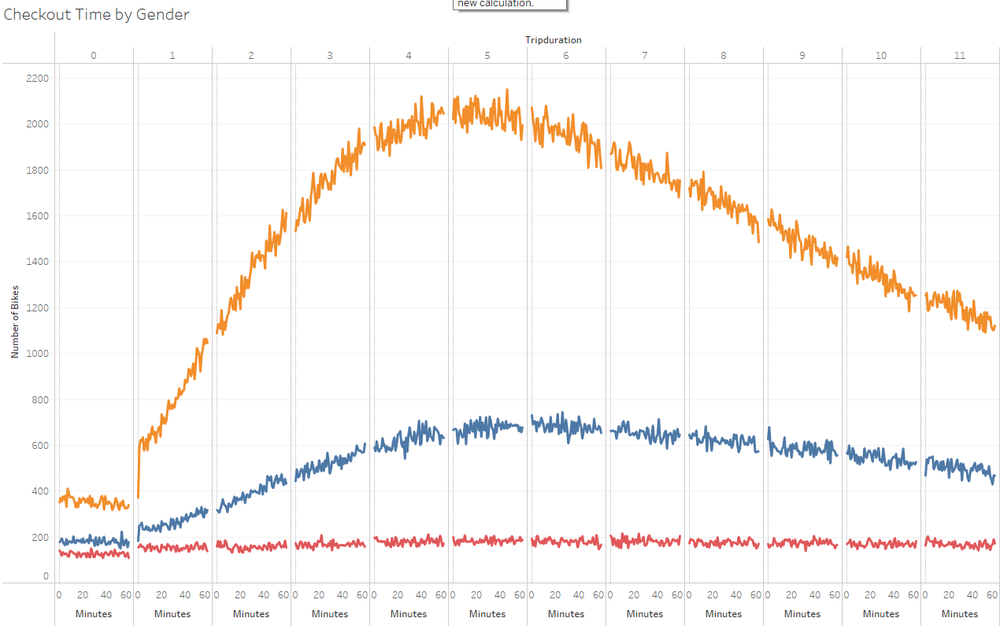

# Bikesharing in New York

## Overview of Analysis

We were taked with analyzing data based on CitiBike bikesharing data in New York City in August (A period of high visitation) to present an analysis and our findings to potential investors into operating a similar business in Des Moine, IA. We were given data from a CSV file consisting of over 2 millionobservations describing customer types, starting and stopping locations, starting and stopping times, gender, and trip durations.  Tableau was used to create visualizations of the data for presentation pruposes. 

## Results
### Starting and Ending Points

Overall, our data shows that most trips start and stop on the island of Manhattan. Given later data showing that most trips are for commuting purposes, the most likely user would be workers who live and work in close enough proximity to jsutify uses of the bikes. 

### Usage by Time and Gender

Most trips 

## Summary

### See it For Yourself
-----------------------------------
[Link to Tableau Story](https://public.tableau.com/app/profile/nathan.thomas.esch/viz/CitiBikeChallenge_16496177349530/CitiBikeData?publish=yes)
