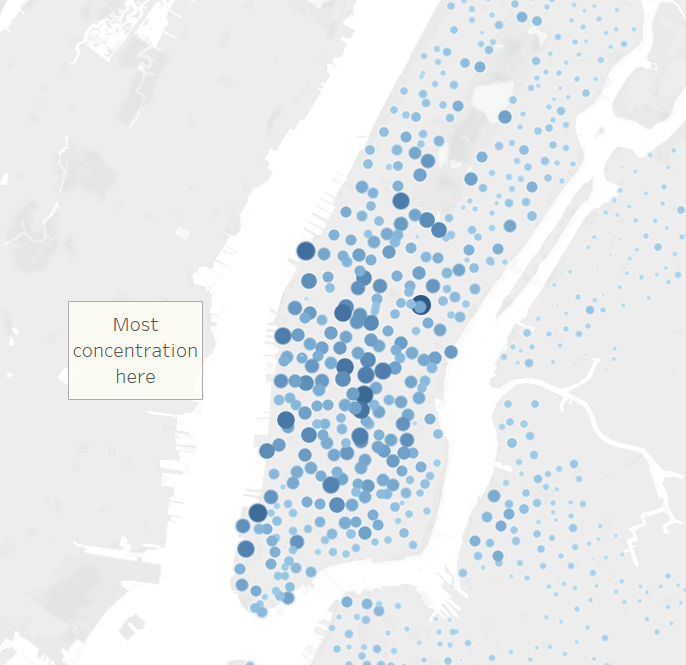
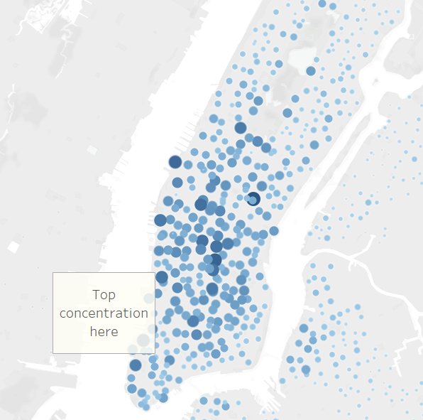
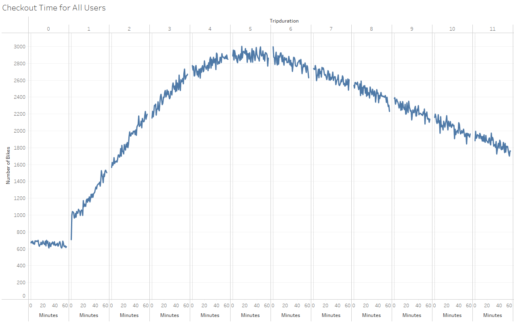
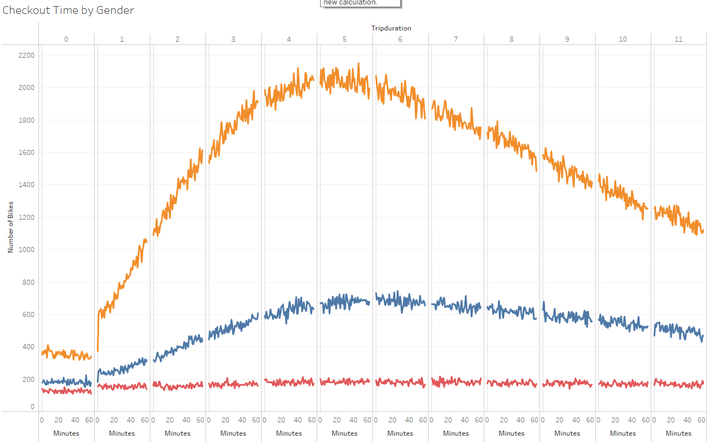
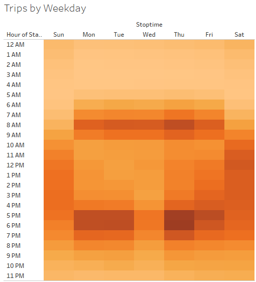
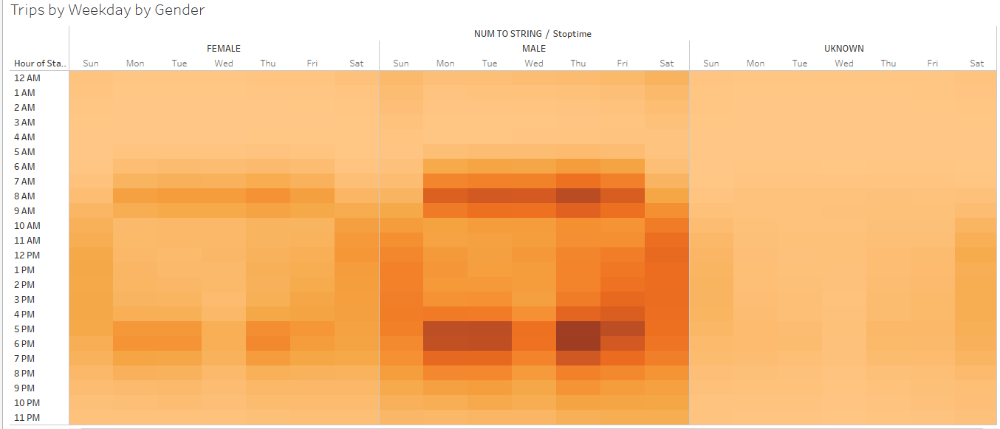
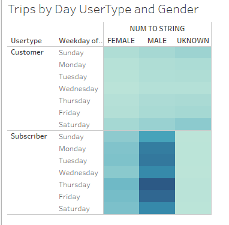

# Bikesharing in New York

## Overview of Analysis

We were taked with analyzing data based on CitiBike bikesharing data in New York City in August (A period of high visitation) to present an analysis and our findings to potential investors into operating a similar business in Des Moine, IA. We were given data from a CSV file consisting of over 2 millionobservations describing customer types, starting and stopping locations, starting and stopping times, gender, and trip durations.  Tableau was used to create visualizations of the data for presentation pruposes. 

## Results
### Starting and Ending Points

Overall, our data shows that most trips start and stop on the island of Manhattan. Given later data showing that most trips are for commuting purposes, the most likely user would be workers who live and work in close enough proximity to jsutify uses of the bikes. 

### Usage by Time and Gender

Most trips occur at the fifth hour and gender information indicates that males consist of the majority of the user base. 

### Daily Data

The most common time for usage occurs during the commuting hours during the standard work week. High usage time for the weekend occurs during the hours of 10 AM to 5 PM indicating sightseeing and leisure activity. The patterns are consistent across both male and female users.  Additionally, a majority of users tend to be subscribers.  Subscriber usage is especially high during commuting hours indicating. One-time customers do not exhibit a discernable pattern of activity. 

## Summary
Overall, our analysis concludes that the highest usage of Citibikes in New York in August tend to be male subscription customers using the service primarily during the week to get to and from work. Further analysis should include a bubble visualization of the number of rides at each station ID.  Further research could be done for nearby landmarks and establishments to determine their relationship to usage. A map chart showing the average distance between stations in areas of high rider-density would also give insight into placement of CitiBike stations in Des Moines.  

### See it For Yourself
-----------------------------------
[Link to Tableau Story](https://public.tableau.com/app/profile/nathan.thomas.esch/viz/CitiBikeChallenge_16496177349530/CitiBikeData?publish=yes)
